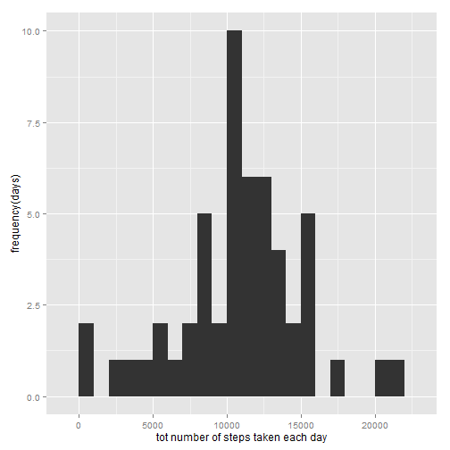
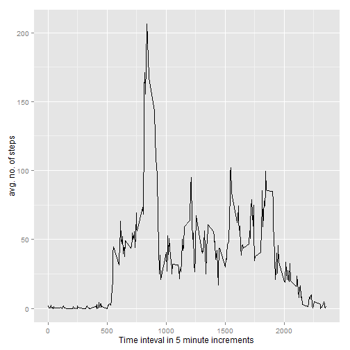
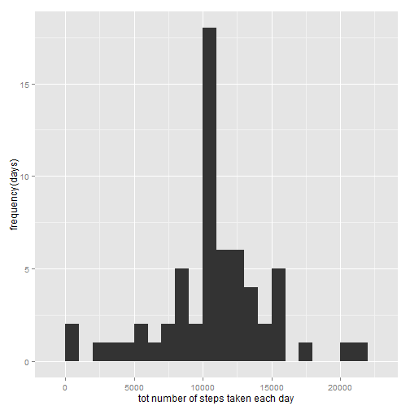
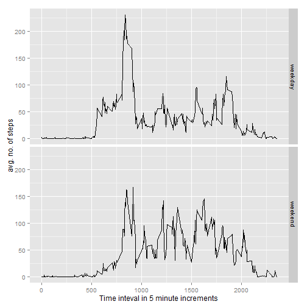

# Reproducible Research Coursera Data Scientist Track: 
# Peer Assessment 1


## Introduction
It is now possible to collect a large amount of data about personal movement using activity monitoring 
devices such as a Fitbit, Nike Fuelband, or Jawbone Up. These type of devices are part of the 
“quantified self” movement – a group of enthusiasts who take measurements about themselves regularly to 
improve their health, to find patterns in their behavior, or because they are tech geeks. But these data 
remain under-utilized both because the raw data are hard to obtain and there is a lack of statistical methods 
and software for processing and interpreting the data.

This assignment makes use of data from a personal activity monitoring device. This device collects data at 
5 minute intervals through out the day. The data consists of two months of data from an anonymous individual 
collected during the months of October and November, 2012 and include the number of steps taken in 5 minute 
intervals each day.

## Data
The data for this assignment can be downloaded from the course web site:

Dataset: Activity monitoring data [52K] at https://d396qusza40orc.cloudfront.net/repdata%2Fdata%2Factivity.zip

The variables included in this dataset are:

. steps: Number of steps taking in a 5-minute interval (missing values are coded as NA)

. date: The date on which the measurement was taken in YYYY-MM-DD format

. interval: Identifier for the 5-minute interval in which measurement was taken

The dataset is stored in a comma-separated-value (CSV) file and there are a total of 17,568 observations in this 
dataset.

## Assignment

This is a multi-part assignment with various processing and analysis steps described below.

### Loading and preprocessing the data
. Make sure the working directory is set to the folder where the data was downloaded and unzipped.
. Load the data

```r
act <- read.csv(file="activity.csv",header=TRUE,sep=",")
```

### What is the mean number of steps taken per day?
For this part of the assignment missing values are ignored

. Calculate the total number of steps taken per day

```r
tot_steps <- aggregate(act["steps"],by=list(act$date),FUN=sum)
```

. Make a histogram of the total number of steps taken each day

```r
library(ggplot2)

qplot(tot_steps$steps,binwidth=1000,xlab="tot number of steps taken each day", 
ylab="frequency(days)")
```

 

. Calculate the mean and median of the total number of steps taken per day

```r
mean(tot_steps$steps,na.rm=TRUE)
```

```
## [1] 10766.19
```

```r
median(tot_steps$steps,na.rm=TRUE)
```

```
## [1] 10765
```

### What is the average daily activity pattern?
. Make a time-series plot of the 5-minute interval x-axis and the average number of steps taken, averaged across
all days (y-axis)

```r
avg_steps_int <- aggregate(act["steps"],by=list(act$interval),FUN=mean, na.rm=TRUE)

qplot(avg_steps_int$Group.1,avg_steps_int$steps,data=avg_steps_int,geom="line",
xlab="Time inteval in 5 minute increments",ylab="avg. no. of steps")
```

 
. Which 5-minute interval across all the days in the dataset contains the maximum number of steps

```r
avg_steps_int[which.max(avg_steps_int$steps),]
```

```
##     Group.1    steps
## 104     835 206.1698
```

### Imputing missing values
Note that there a number of days/intervals where there are missing values coded as NA. The presence of missing values 
may introduce a bias into some of the calculations or summaries of the data.

. Calculate and report the total number of missing values in the data set.

```r
missing_steps <- is.na(act$steps)

sum(missing_steps)
```

```
## [1] 2304
```
. Devise a strategy for filling in all of the missing values in the data set. In this case we have devised a very 
simple strategy - used the mean for that day for that 5-minute interval. 

. The new data set is stored in a data frame called act_enhanced

```r
act_enhanced <- act

for (i in 1:nrow(act_enhanced)) {
  if(is.na(act_enhanced[i,"steps"]))
    act_enhanced[i,"steps"] <- avg_steps_int[avg_steps_int$Group.1 == act_enhanced[i,"interval"], "steps"]
}

tot_steps_enhanced <- aggregate(act_enhanced["steps"],by=list(act_enhanced$date),FUN=sum)
```

. Make a histogram of the total number of steps taken each day and calculate and report the mean and median total 
number of steps taken per day. 

```r
qplot(tot_steps_enhanced$steps,binwidth=1000,xlab="tot number of steps taken each day",
ylab="frequency(days)")
```

 

. Do the mean and median values differ from the earlier part of the assignment? What is the impact of missing data on 
the estimates of the total daily number of steps?

```r
mean(tot_steps_enhanced$steps)
```

```
## [1] 10766.19
```

```r
median(tot_steps_enhanced$steps,na.rm=TRUE)
```

```
## [1] 10766.19
```
As you can see from the above the mean remains the same (because the missing values were substituted by the mean) whereas
the median does change.

### Are there any differences in activity patterns weekdays and weekends?

. Create a new factor variable in the dataset with two levels - "weekday" and "weekend" indicating whether a given date 
is weekday or weekend.

```r
for (i in 1:nrow(act_enhanced)) {
  if(weekdays(as.Date(act_enhanced[i,"date"])) %in% c("Monday","Tuesday","Wednesday","Thursday","Friday"))
    act_enhanced[i,"day_type"] <- "weekday"
  else 
    act_enhanced[i,"day_type"] <- "weekend"
}
```

. Make a panel plot containing the time series plot of the 5-minute interval (x-axis) and the average number of steps taken
averaged across all weekday days and all weekend days (y-axis). 


```r
avg_steps_int_enhanced <- aggregate(steps ~ interval + day_type, data=act_enhanced, mean)

qplot(avg_steps_int_enhanced$interval,avg_steps_int_enhanced$steps,data=avg_steps_int_enhanced,geom="line",
xlab="Time inteval in 5 minute increments",ylab="avg. no. of steps",facets=day_type~.)
```

 

A quick/casual glance at the weekday and weekend plots seems to indicate that the difference between the average 
number of steps taken on a weekend vs. a weekday within a time interval is inconclusive at best (would require
more/deeper analysis). Though the maximum number of steps in an interval certainly seems much higher for a weekday.
